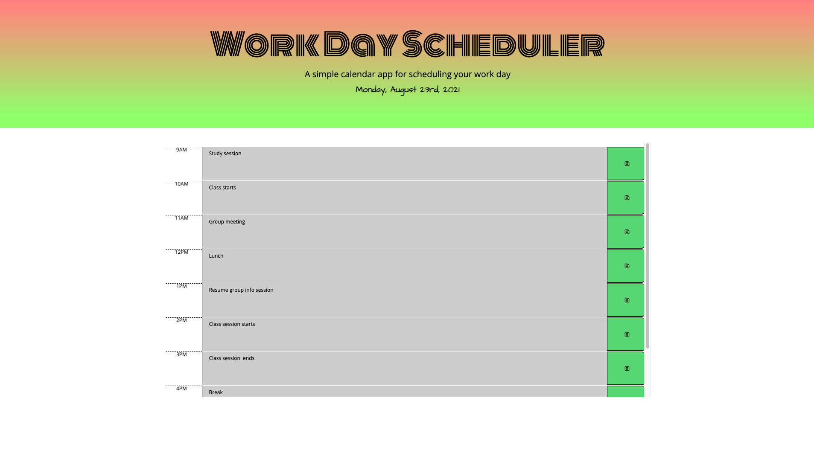

# Work Day Scheduler

# Table of Contents

* [Description](#description)
* [Instalation](#instalation)
* [Usage](#usage)
* [Tools](#tools)
* [Contact](#contact)
* [License](#license)
* [Acknowledgements](#acknowledgements)

## Description 
To generate a calendar application that allows users to save events for each hour of the day and also add tasks. 

## Instalation
For installation and deployment, please [click here](https://kimberly-rodriguez.github.io/work-day-scheduler/). The GitHub link is [here](https://github.com/Kimberly-Rodriguez/work-day-scheduler)

## Usage

To stay organized and manage time effectively this applicatoin will help deliever the following fuctions:
 - Add important events to a daily planner
 - Acceptance Criteria
 - As the planner opens then the current day is displayed at the top of the calendar
 - Scrolling down presentes the user with timeblocks for standard business hours
 - As the timeblock displays on the webpage that day then each timeblock is color coded to indicate whether it is in the past, present, or future
 - As the event is entered it is saved by a saved button for that timeblock then the text for that event is saved in local storage
 - And when the page is refreshed then the saved events persist

The following images demonstrates the application functionality:

 

## Tools

* This app will run in the browser and feature HTML and CSS powered by jQuery.

* This application uses the Moment.js library to modify the date and time. 

## Contact

If you have any question about my work or wish to collaborate in the future please contact me at: <krodriguez.ucla@gmail.com>

## License 

Licensed under the [MIT License](LICENSE).

## Acknowledgements
[UCLA Extension Coding Bootcamp](https://bootcamp.uclaextension.edu/coding/)

